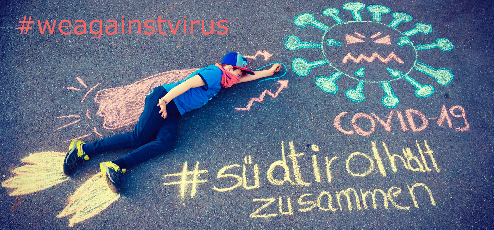

# We Against Virus - TJ, DG, FT
### Authors: Daniele Gadler, Francesco Tosoni, Tajammul Mustafa

### 3rd place winners of the #WeAgainstVirus hackathon by "Hack the Alps" on 27th-28th March 2020. 



Pharmacy queues prototype:
A simple portal where the local people can visualize the number of customers in the waiting line at a pharmacy.
Grab your phone, take a picture, upload it on the website, and the number of people waiting in queue is going
to be automatically detected!

Based on Flask, a small local DB and <a href="https://nanonets.com/"> Nanonetes' </a> API for people detection. 

# Requirements:
- Linux
- Python3.6+ (Python3.7 works as well)

# Installation:

Install the requirements:

```bash
cd map_frontend
pip install -r requirements.txt
```

The database has to be moved into the `tmp` folder:

```bash
cp db_backend/test.db /tmp/test.db
```

# Running:

## 1. Run the DB application

```bash
cd db_backend
flask run --port 5001
```

## 2. Run the Google Map application

```bash
cd map_frontend
flask run --port 5000
```
